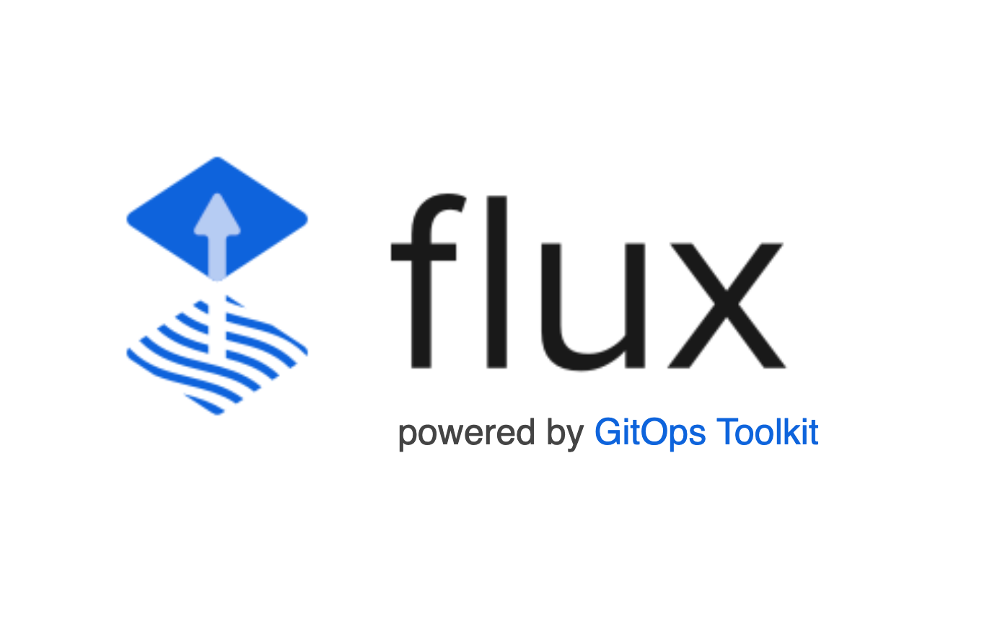

<div style="text-align: center;
   align-content: center;
   align-items: center;">
    <h1><b>Flux Config</b></h1>
    
    <p> GitOps for Kubernetes </p>
</div>

## Getting started

### Prerequisites

1. Get a Kubernetes cluster
   You can use any Kubernetes cluster you have access to. If you don't have one, you can create a cluster locally
   using [kind](https://kind.sigs.k8s.io/).
2. Install flux cli
   see [flux cli](https://fluxcd.io/flux/installation/) for installation instructions.
3. Bootstrap flux
   see [flux bootstrap](https://fluxcd.io/docs/get-started/#bootstrapping-flux) for instructions.
   Bootstrapping flux will install flux in your cluster and sync the cluster state with the git repository.

   Before you bootstrap flux, you need to create PAT(Personal Access Token), which will be used by flux to access the
   git
   repository.
   You can create a PAT by following the
   instructions [here](https://docs.gitlab.com/ee/user/profile/personal_access_tokens.html#creating-a-personal-access-token).

   Then, you need to export the PAT as an environment variable.

    ```shell
    export GITLAB_TOKEN=<your-gitlab-token>
    export GITLAB_USER=<your-gitlab-username>
    ```

   And then bootstrap flux using the following command.

    ```shell
    flux bootstrap gitlab \
      --owner=$GITLAB_USER \
      --repository=flux-config \  
      --branch=main \
      --path=clusters/arm-cluster \
      --deploy-token-auth \
      --components-extra=image-reflector-controller,image-automation-controller 
    ```

## Infrastructure

### Cert Manager

Cert manager is used to manage certificates in the cluster. It is deployed in the cert-manager namespace.
It is deployed using the helm chart [cert-manager](https://cert-manager.io/docs/installation/helm/).

### Monitoring

1. [Prometheus+Grafana](./infrastructure/monitoring/kube-prometheus-stack)
   The kube prometheus stack is used for monitoring metrics in the cluster. It is deployed in the monitoring namespace.
   It is
   deployed
   using the helm chart [kube-prometheus-stack](https://prometheus-community.github.io/helm-charts).

2. [Loki](./infrastructure/monitoring/loki)
   Loki is used for log aggregation. Loki is deployed in the monitoring
   namespace.
   It is deployed using the helm chart [loki-stack](https://grafana.github.io/loki/charts).
3. [Promtail](./infrastructure/monitoring/promtail)
   Promtail is used to scrape logs from the cluster and send them to Loki. Promtail is deployed in the monitoring
   namespace.
   It is deployed using the helm chart [promtail](https://grafana.github.io/loki/charts).

## Usage

Use examples liberally, and show the expected output if you can. It's helpful to have inline the smallest example of
usage that you can demonstrate, while providing links to more sophisticated examples if they are too long to reasonably
include in the README.

## Support

Tell people where they can go to for help. It can be any combination of an issue tracker, a chat room, an email address,
etc.

## Roadmap

If you have ideas for releases in the future, it is a good idea to list them in the README.

## Contributing

State if you are open to contributions and what your requirements are for accepting them.

For people who want to make changes to your project, it's helpful to have some documentation on how to get started.
Perhaps there is a script that they should run or some environment variables that they need to set. Make these steps
explicit. These instructions could also be useful to your future self.

You can also document commands to lint the code or run tests. These steps help to ensure high code quality and reduce
the likelihood that the changes inadvertently break something. Having instructions for running tests is especially
helpful if it requires external setup, such as starting a Selenium server for testing in a browser.

## Authors and acknowledgment

Show your appreciation to those who have contributed to the project.

## License

For open source projects, say how it is licensed.

## Project status

If you have run out of energy or time for your project, put a note at the top of the README saying that development has
slowed down or stopped completely. Someone may choose to fork your project or volunteer to step in as a maintainer or
owner, allowing your project to keep going. You can also make an explicit request for maintainers.

```shell
export KUBECONFIG=/mnt/c/Users/appad/AppData/Roaming/Lens/kubeconfigs/18382e06-288c-425c-bd91-5538878b9924
export SEALED_SECRETS_CONTROLLER_NAMESPACE=flux-system
```